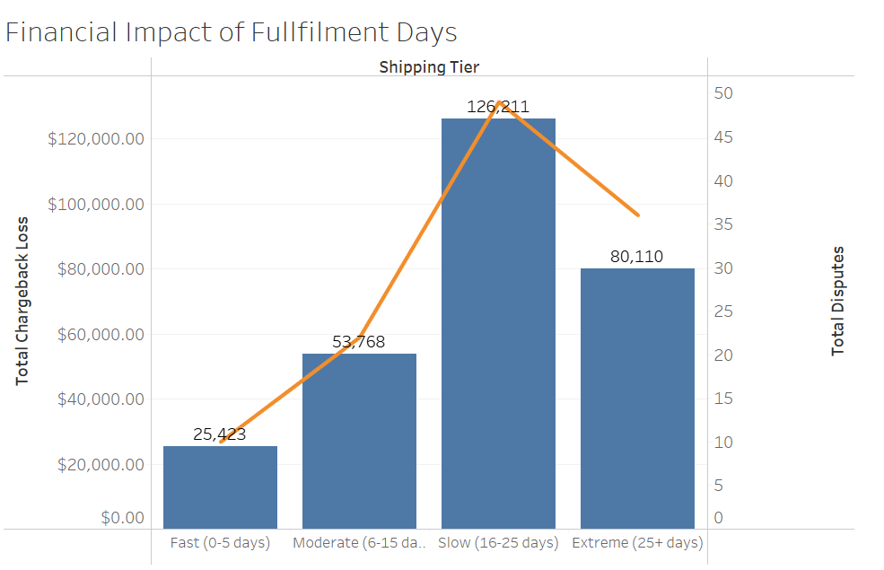
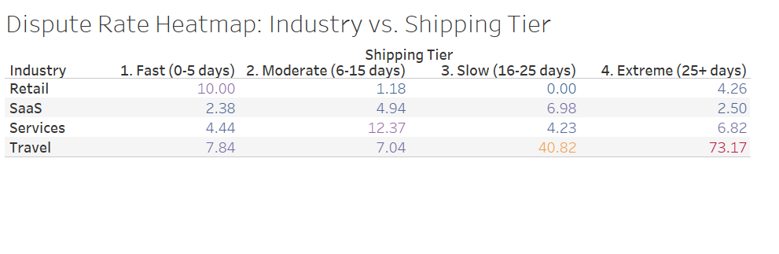

# 📈 Analysis: Shipping Delays & Merchant Credit Risk

## **Executive Summary**
This project identifies the threshold at which merchant shipping delays become a financial liability. Using a synthetic dataset of 1,000 accounts to maintain data privacy, this analysis identified a critical threshold at the **15-day mark**, where customer disputes escalate sharply. These delays resulted in a **$126,000 loss** in a single month. The **Travel industry** was identified as the highest-risk sector, with a **73% dispute rate** during significant fulfillment lags.

---

## **The Business Problem: Shipping Delays and Financial Risk**
Fulfillment delays are a primary driver of customer disputes. Currently, the business applies a "one-size-fits-all" risk policy that does not account for how different industries manage shipping times. This creates significant **risk exposure**: without data-driven thresholds to flag slow shippers early, the current framework fails to trigger necessary interventions, leaving the platform to absorb the cost of disputes that could have been prevented.

---

<b>🛠️ Click to view Data Definitions (Technical Dictionary)</b>

| Column Name | Description | Role in Analysis |
| :--- | :--- | :--- |
| **industry** | Business category (Travel, SaaS, etc.) | High-risk sector identification |
| **days_to_ship** | Days from order to fulfillment | Risk threshold variable |
| **is_disputed** | 1 if customer disputed; 0 if not | Primary risk outcome |
| **chargeback_amount** | Dollar value of the dispute | Loss quantification ($126k total) |

---

## **Methodology**
SQL was utilized for data processing, and Tableau for trend visualization to identify danger zones:

* **Segmentation:** Categorized merchants into speed tiers (Fast, Moderate, Slow, Extreme) to isolate the primary drivers of loss.
* **Loss Quantification:** Calculated the total dollar value of disputes within each tier to identify the peak Risk Window.
* **Industry Sensitivity Mapping:** Cross-referenced shipping speed with industry types to identify high-risk outliers like the Travel sector.

---

## **Technical Skills Demonstrated**
* **SQL:** Advanced data aggregation and conditional logic (`CASE` statements) used to categorize merchants and calculate financial exposure.
* **Tableau:** Developed interactive heatmaps and financial impact charts to translate raw data into executive insights.
* **Risk Analytics:** Designed data-driven mitigation strategies to protect platform liquidity and cash flow.

---

## **The Results**

### **1. Financial Impact of Delays**

**The Insight:** Risk remains stable until Day 15. Beyond this point, the platform enters a **"Critical threshold"** where aggregate losses peak at **$126,000** for the 16–25 day tier.

### **2. Industry Sensitivity Analysis**

**The Insight:** The Travel sector is the most fragile industry analyzed. At 25+ days of delay, nearly **73% of customers** file a formal dispute.

---

## **Strategic Recommendations**

* **Implement a Rolling Reserve "Safety Net":** For merchants with shipping averages between 16–25 days, the platform should automatically hold **20% of sales** in reserve. This secures funds to cover potential disputes and protects the company's cash flow.
* **Establish Industry-Specific Guardrails:** Because the Travel sector is highly sensitive to latency, stricter thresholds are required. Initiating fund holds for Travel merchants at **Day 15** (rather than Day 25) directly addresses the identified 73% dispute risk.
* **Deploy an Automated Early-Warning System:** An automated dashboard should notify the Risk Team the moment a merchant’s fulfillment time exceeds **15 days**. This shift allows for proactive intervention before emerging risks escalate into unrecoverable financial losses.

---

<b>💻 Technical Instructions: How to Reproduce this Analysis</b>

1. **Clone the Repo:** `git clone https://github.com/Aquababy98/Merchant-Risk-Analysis`
2. **Database:** Load `Merchant_health_mock_data.csv` into your SQL environment.
3. **Execution:** Run the queries located in the `Merchant_Risk.sql` file to generate the Risk Tiers.

---

### **Note on Data Privacy & Source**
**Data Source:** The foundation of this project utilizes a dataset sourced from [Mockaroo](https://www.mockaroo.com). 

**Privacy & Synthesis:** To maintain professional standards of data privacy, all merchant identifiers and financial figures have been **synthetically generated**. While the specific data points are simulated, the risk logic, SQL queries, and strategic findings are designed to reflect authentic challenges found in the Merchant Credit Risk and Fintech sectors.
